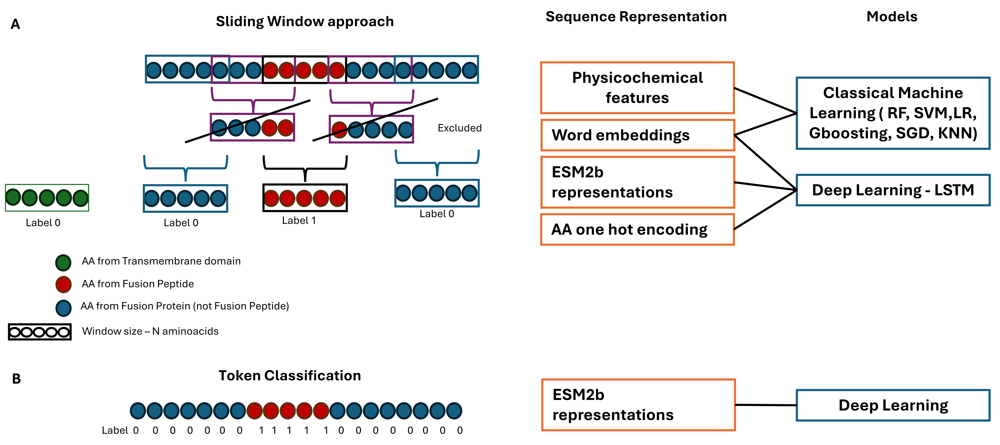

[//]: # ([![License]&#40;https://img.shields.io/badge/license-MIT-blue.svg&#41;]&#40;LICENSE&#41;)

# Machine and deep learning to predict Viral fusion peptides 

This repository contains the files for the paper : 

## Table of Contents
- [Project Description/Abstract](#project-description)
- [Credits](#credits)
- [License](#license)
- [Contributing](#contributing)

## Project Description/Abstract

Viral fusion proteins located on the surface of enveloped viruses like SARS-CoV-2, Influenza, and HIV, play a vital role in fusing the virus with host cell membranes. Fusion peptides, conserved segments within these proteins, are crucial for the fusion process and are potential targets for therapy. Experimental identification of fusion peptides is time-consuming and costly, making bioinformatics tools essential. Although homology methods have been used towards this end, they fail to identify fusion peptides lacking overall sequence similarity to known counterparts. Therefore, alternative methods that do not rely on sequence identity are needed to discover new putative fusion peptides. Recent advances in artificial intelligence, particularly in protein classification, have confirmed that machine learning (ML) methods can develop promising approaches.
A scheme overview of Viral Fusion Protein: 

In this study, we explore various ML-based approaches to identify fusion peptides within a fusion protein sequence. We employ token classification methods and sliding window approaches coupled with machine and deep learning models. We evaluate different protein sequence representations, including one-hot encoding, physicochemical features, as well as representations from Natural Language Processing, such as word embeddings and transformers. Through the examination of over 50 combinations of models and features, we achieve promising results. The most successful models achieved are based on a state-of-the-art transformer for aminoacid token classification. Furthermore, we utilize the best models to predict hypothetical fusion peptides from SARS-CoV-2, and critically analyse annotated peptides from existing research. 
Overall, our models effectively predict the location of fusion peptides, even in viruses for which limited experimental data is available.

General view of the project: 

## Credits
If you find this repository useful in your research or for educational purposes please refer to:

## License

Developed at the  
Centre of Biological Engineering, University of Minho, Portugal

Released under the GNU Public License (version 3.0).

[//]: # (.. |License| image:: https://img.shields.io/badge/license-GPL%20v3.0-blue.svg)
